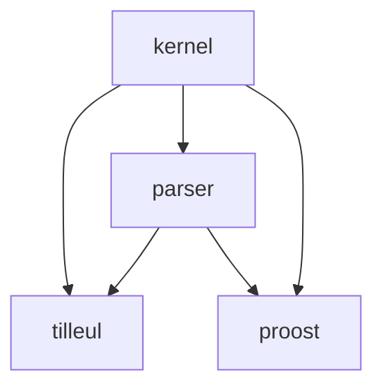

# Proost

A simple proof assistant written in Rust.

The specification of the project may be found [here](https://gitlab.crans.org/loutr/proost/-/blob/main/docs/specs.pdf).

The documentation, generated with `rust-doc` may be found [here](https://perso.crans.org/v-lafeychine/proost/doc/proost/).

### Usage 
Please see the specification for insights on how to use proost and tilleul.

### Build and install
With `nix` installed, type `nix build` to perform a build and have it in the nix store. One can also type `nix profile install` in the repo to install *proost* to one's profile and use it everywhere!

### Development environment
With `nix` installed, simply type `nix develop`. This provides an environment with all the necessary tools, including `clippy` and `rustfmt`. There, it is possible to run the usual `cargo build` and so on.

Please consider the syntax `nix develop --profile <a-file-of-your-choosing>`, which will prevent the garbage collection of the development dependencies.

### Crates dependencies

