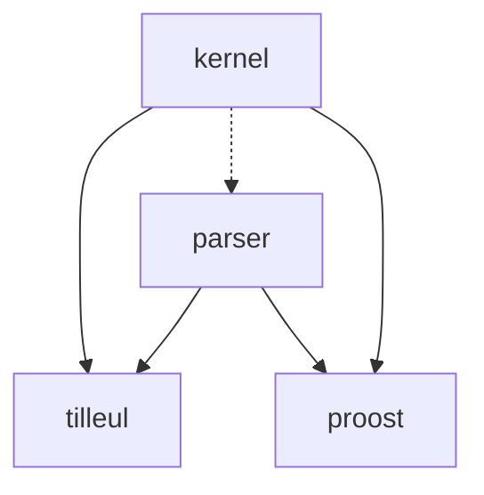

<p align="center">
  
</p>

# Proost
A simple proof assistant written in Rust.

The specification of the project may be found [here](docs/specs.pdf), and the
user manual [here](docs/manual.pdf). The API documentation can be found by
clicking on the corresponding badge below the project name.

## Build and install
To install proost with `nix` installed, simply type:
```sh
nix profile install git+ssh://git@gitlab.crans.org/loutr/proost.git?ref=main
```
A toplevel instance can then be launched with `proost`. Alternatively, replace
`profile install` with `run` to give the program a go without installing it.

Without `nix` installed, `git clone` the project and, with Rust and
[`cargo`](https://doc.rust-lang.org/stable/cargo/) properly setup to an
appropriate version (either through your package manager or
[`rustup`](https://rustup.rs/)), do `cargo run --release`.

## Development environment (with `nix`)
Type `nix develop`. This provides an environment with all the necessary tools,
including `cargo` (with `clippy`, `rustfmt`) and `rust-analyzer`. Then, use your
regular `cargo` commands.

Please consider the syntax `nix develop --profile <a-file-of-your-choosing>`,
which will prevent the garbage collection of the development dependencies as
long as the given file lives.

## Crates
The project is organised as such:
- the crate `kernel` provides an interface for building and manipulating terms,
  as well as type inference and type checking functions;
- the crate `parser` provides parsing functions which return `Builder` objects,
  which can be seen as template that can be provided to the kernel to get a
  real, well-formed term to perform computations upon;
- the crate `proost` provides a toplevel interface for end-users that can be
  used to manipulate terms and query the kernel. It provides partial
  auto-completion, some color highlighting and other readline-like features;
- the crate `tilleul`, which is still in preparation, which will implement the
  Language Server Protocol.


